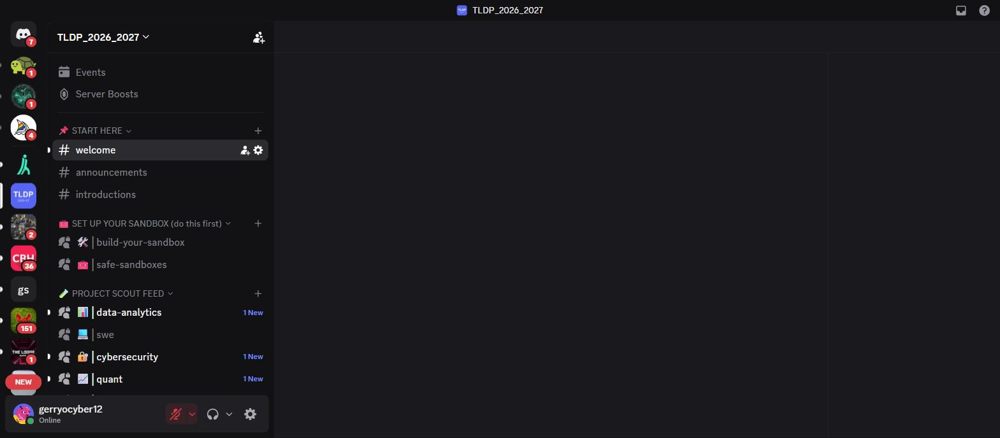
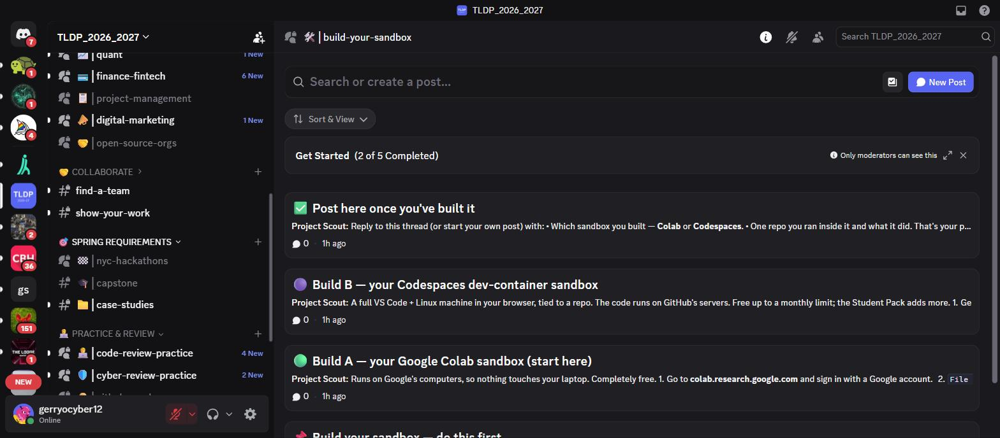
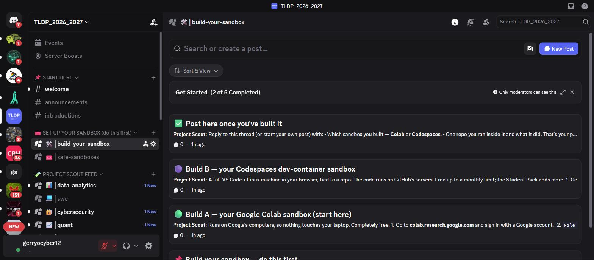

# Building the TLDP private Discord server

A record of the private Discord server I designed and built for the Baruch TLDP cohort (45 students), for my resume and
portfolio. The whole server is provisioned **from code** (`discord_setup.py`) rather than clicked together by hand, so
it is reproducible and version-controlled.

## What it is

A gated, single-purpose community server that turns a stream of automatically-screened GitHub project ideas into a
structured learning program: per-major project feeds, a "set up your sandbox first" onboarding, interview practice,
spring requirements (a hackathon and a capstone), and a case-study library.

## How I built it, step by step

I built the server as **infrastructure-as-code** rather than clicking it together, so it's reproducible and
version-controlled. The provisioning logic lives in `discord_setup.py` in the project repo.

1. **Created the Discord application and bot** in the Discord Developer Portal, and created the server
   `TLDP_2026_2027`. Set the server verification level to Medium (verified email required before posting) and removed
   the "Create Invite" permission from `@everyone` so only staff can invite.
2. **Designed the role model** with least privilege: `TLDP Staff` (admin), `TLDP Student` (the gate that unlocks the
   learning content), and one mentionable role per major (Cybersecurity, SWE, Quant, and so on). The automation bot's
   role sits below staff.
3. **Designed the category and channel layout in code** as a single data structure: which categories are gated, and
   which channels are text vs. forum. This made the whole server a diff I could review, not a series of clicks.
4. **Provisioned everything in one idempotent run** of `discord_setup.py`, which creates the categories, channels,
   permission overwrites, and webhooks, and can be re-run safely to apply changes.
5. **Gated the content** with permission overwrites so that every learning category is hidden until a member holds the
   `TLDP Student` role; only the START HERE category is visible to newcomers.
6. **Created a webhook per feed channel** so the automated bot can post screened repositories into the right major's
   forum, and stored those webhook URLs as a secret for the GitHub Actions job.
7. **Seeded the content** the script posts automatically: the pinned welcome and rules, the sandbox lessons, the
   interview-practice rubrics and worked examples, and the GitHub Academy lessons.
8. **Ordered onboarding so safety comes first** — I placed the "SET UP YOUR SANDBOX (do this first)" category directly
   after START HERE, so a student's first action is building a safe place to run code.
9. **Set up enrollment** (`enroll.py`): the staff roster becomes a distribution list of unique, single-use, expiring
   invites, and staff grant the Student role to members who join. Access is controlled by the roster, not by anyone
   typing a name.
10. **Added the staff administrators** and wired the automation: a GitHub Actions job posts the screened feed through
    the channel webhooks, and a Cloudflare Worker answers the `/scout` and `/verify` slash commands.

Re-running is a single command (`python discord_setup.py`), which is what makes this reproducible: the entire server
can be rebuilt or updated from code.

## Channel architecture

I organized the server into purpose-built categories, each gated so only verified students see the learning content.

- **📌 START HERE** (open): welcome, announcements, introductions — the only thing a newcomer sees before verification.
- **🧰 SET UP YOUR SANDBOX (do this first)**: I deliberately placed this *second*, right after START HERE, so the first
  thing a student does is build a safe environment to run code in.
- **🧪 PROJECT SCOUT FEED**: one forum per major (Data Analytics, SWE, Cybersecurity, Quant, Finance/FinTech, Project
  Management, Digital Marketing) plus open-source orgs. A bot posts fresh, pre-screened repositories here every 6 hours.

- **🤝 COLLABORATE**: find-a-team, show-your-work.
- **🎯 SPRING REQUIREMENTS**: nyc-hackathons (auto-updated), capstone, case-studies.
- **🧑‍💻 PRACTICE & REVIEW**: code-review-practice, cyber-review-practice, GitHub Academy — interview-style practice
  with worked examples and rubrics.

## Safety-first onboarding I designed

The sandbox category isn't just a link dump — I wrote a hands-on, four-post progression that walks a student through
**building their own reusable sandbox** (Google Colab or a GitHub Codespaces dev container) before they run any
project, with the rules that public/synthetic data only and no secrets ever go into a sandbox.

## Automation and integration

- **Provisioned from code:** `discord_setup.py` creates the categories, channels, roles, permission overwrites,
  webhooks and seeded posts in one run, and is idempotent (safe to re-run).
- **Live feed:** a GitHub Actions job posts screened repositories into each major's forum via per-channel webhooks;
  Cloudflare Workers answer on-demand `/scout` and `/verify` slash commands.
- **Safe messages:** every posting path disables automatic mentions and escapes third-party text, so a repository name
  or description can never smuggle a fake link or ping into the server.

## Security and access control

- **Gated by role.** All learning content is hidden until a student holds the *TLDP Student* role; START HERE stays
  visible so newcomers can read the rules.
- **Roster-controlled enrollment.** Access is granted through unique, single-use, expiring invites issued from the
  staff roster — not by typing a name — so there is no way to guess your way in and no roster is ever exposed.
- **Least-privilege roles.** Staff and student roles are separated; the automation bot sits below staff and holds only
  the permissions it needs.
- **Verified-email requirement** and staff-only invite creation.

## Skills this demonstrates

- **Infrastructure as code / automation:** provisioning an entire Discord community programmatically and idempotently.
- **Security architecture:** role-based access control, least privilege, safe-message handling, and a screening gate in
  front of everything students see.
- **Community and program design:** turning a tool into a structured, semester-long learning experience with
  onboarding, practice, and graded requirements.
- **Integration engineering:** GitHub Actions, Cloudflare Workers, webhooks, and the Discord API working together.

## Resume bullets you can adapt

- Designed and built a gated, code-provisioned Discord learning community for a 45-student cohort, integrating a
  GitHub-Actions feed and Cloudflare Workers to deliver automatically-screened project ideas by major.
- Implemented role-based access control, single-use roster-gated enrollment, and safe-message handling (no automatic
  mentions, escaped untrusted text) to keep a student community secure by default.
- Authored a "sandbox-first" onboarding path teaching students to run untrusted code in disposable environments
  (Google Colab, GitHub Codespaces dev containers) before executing any project.

_Server name: TLDP_2026_2027. Built and administered under the account gerryocyber12; the automation and bot code live
at github.com/tldpprojectscout/project-scout._
